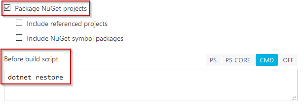
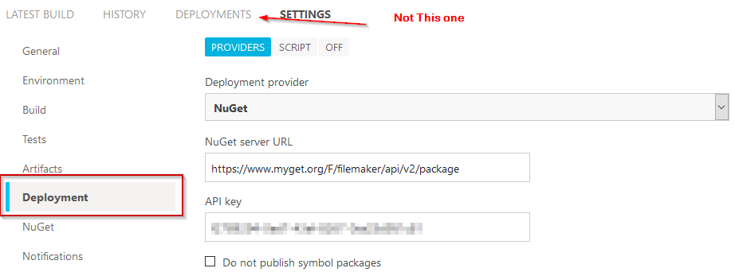
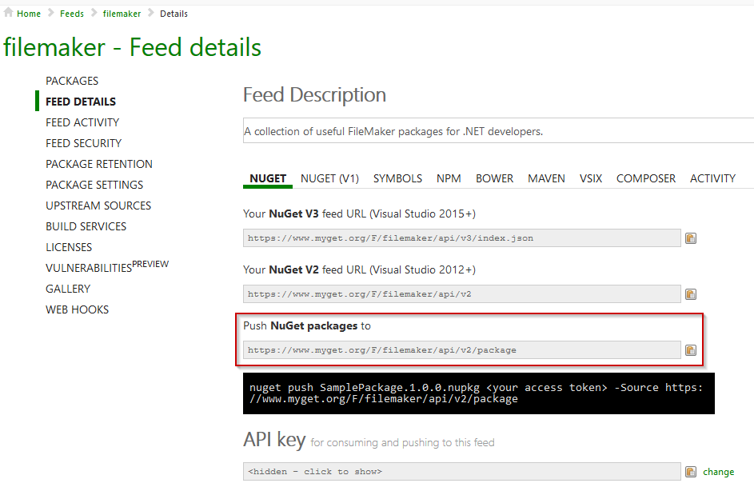

I operate a couple niche open source projects. They don't generate much activity, but they've been useful to me over the years so I share them with the world to help anyone else that happens upon them.

They're hosted on my GitHub page. Which is great for sharing the source code and allowing folks to submit issues and submit pull requests (not that my projects are big enough to get any real activity, but I can hope). There isn't a good way to share the binary output from GitHub. You need to utilize additional tools and software. I'm using AppVeyor and MyGet and I outline my configuration below.

The full CI setup could be achieved with MyGet alone since they also offer build services; but I'm using a combination of MyGet (pre-release package hosting and AppVeyor for builds).

## AppVeyor Setup

In order to get my .NET Standard 2.0 library to build in AppVeyor I had to make a few changes from the default configuration.

### Build Setup



On the build configuration tab you need to tick the box to build Nuget Packages, and most importantly add a pre-build script to perform

```
dotnet restore
```

### Deployment Setup



On the Settings >> Deployment tab, in order to push to MyGet you will need to provide the MyGet Feed Url and API key. Both of these are easy to obtain on your feeds detail page.

### MyGet

There are plenty of resources for setting up a MyGet feed, so I'm not going into those details, but this is where you get the settings utilized in AppVeyor:



The last step is pushing the MyGet packages up to Nuget; which can be done directly through the MyGet interface. Right now, this is a manual process for me. I have two separate AppVeyor builds setup for the same project, pushing to the same MyGet feed. One connected to the develop branch and one linked to master. Within AppVeyor I have enabled assembly version patching so they all end up in the MyGet feed and I can push the master releases out to Nuget.

I'm looking into having the build create release tags in the repository after a successful build, but haven't figured out how I want that to work yet.
