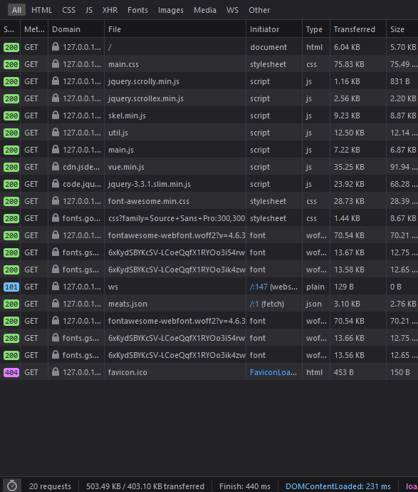
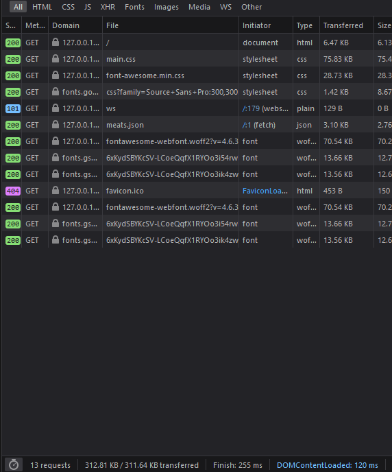
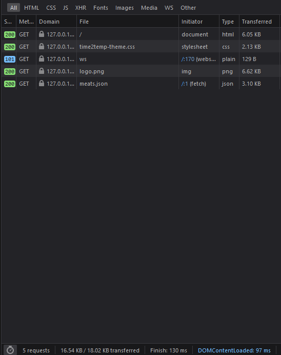

One of my side projects is <https://time2temp.com> -- a simple site for checking bbq times and temperatures. When I originally put the site up, I grabbed an html5up theme, slapped some inline Vue templates, and a bit of javascript to load it up.

It worked, but it was HEAVY: 20 network requests over 500kb!

To serve a single "page" that essentially has a list, that was wildly overkill. How can I make that more simple and more fast?

Drop the framework, and more importantly, drop the bloated CSS theme that included tons of features not used in my simple one page site.

Finally, trimming down the bloated theme and pulling out only the few parts I was actually using resulted in a much slimmer, and by extension faster site that is cheaper to operate:

I also converted the logo from a fancy css based thing to a purely static png one, that is only 6kb. That was a huge savings in terms of data transfer.
