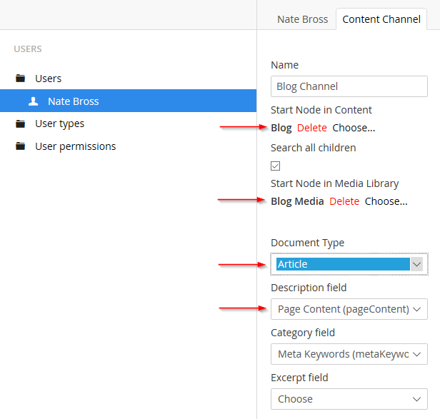

**Update 2018:** Umbraco has removed 'channels' and the underling xmlrpc package that made this work. There might be another way to get it linked up, but I haven't spent time on it or figured it out yet.

Open Live Writer is a great, free, open source version of the late great Windows Live Writer, from the Windows Live Essentials package of yore. I’ve never been a prolific blogger, but having a nice slick thick client for formatting and image maintenance is always great. Using Umbraco and Open Live Writer works well, but it doesn’t have to be only for blogging! With Umbraco Channels you can direct content from Open Live Writer to various areas of your site.

I’ve set this up a dozen times, and every time I have to google around until I find the solution.

## Umbraco Setup

Setup a channel for the user, in the Backoffice go to:

Users => Users => [Your-Account] => Content Channels (Tab)

I’ve called out the important areas.

Start Node in Content: should match the folder you setup in the website.

Start Node in Media Library: useful if you want to keep all the media for your posts grouped together

Document Type: This is the document type that will be created for each Post in Open Live Writer.

Description Field: the field on the document type in which the main content will go.

## Open Live Writer Setup

Website => <http://www.example.com/[folder-if-setup>]

User => Backoffice Username for this channel

Password => Self Explanitory

Blog Type => Metaweblog API

EndPoint => <http://www.example.com/umbraco/channels.aspx>

That’s the part I always forget.

What’s interesting here, is that if you want to manage multiple content sections from within Open Live Writer, you can create multiple Umbraco Backoffice users with one Channel per area in the site. Since Open Live Writer supports multiple accounts, you can link them all up and have a mostly seamless experience. Using different ‘accounts’ is a clunky way to manage multiple areas, but if you think of them as channels it makes some sense.
