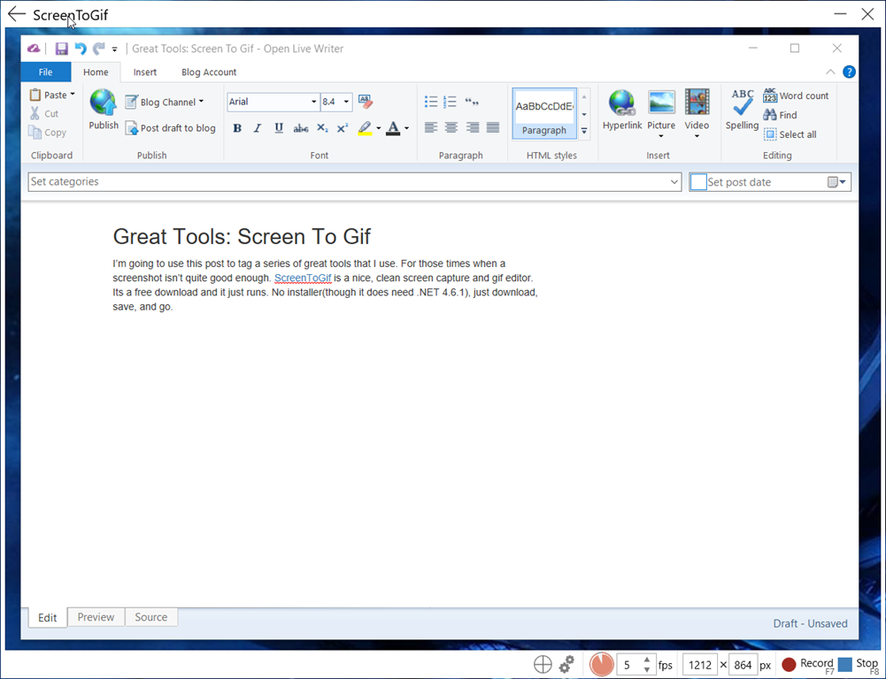
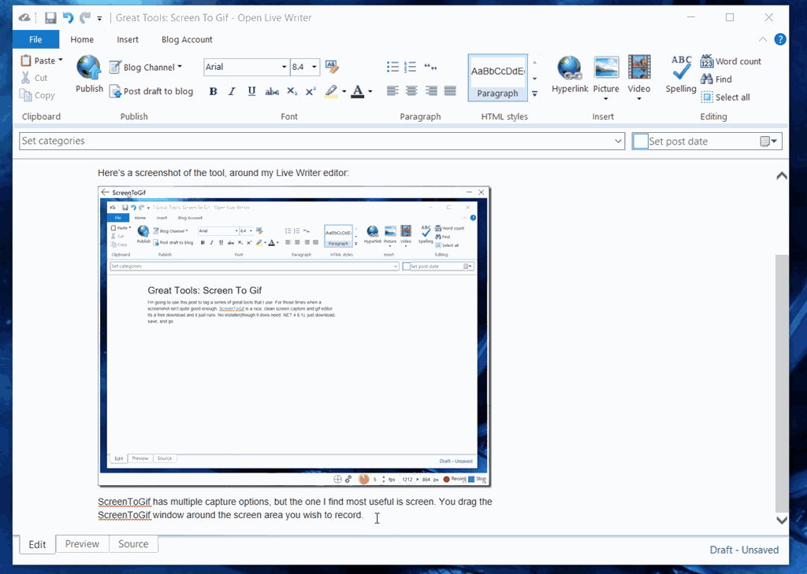

I’m going to use this post to tag a series of great tools that I use. For those times when a screenshot isn’t quite good enough. ScreenToGif is a nice, clean screen capture and gif editor. Its a free download and it just runs. No installer (though it does need .NET 4.6.1) just download, save, and go.

Here’s a screenshot of the tool, around my Live Writer editor:

ScreenToGif has multiple capture options, but the one I find most useful is screen. You drag the ScreenToGif window around the screen area you wish to record. You simply hit the record/stop buttons to record while you work, then it opens your project in the editor to make any post-production changes you need. Then you can save as a .gif file for distribution.

Here is a short recording of the above:

Often a screenshot is plenty, but sometimes a quick gif communicates so much more.
